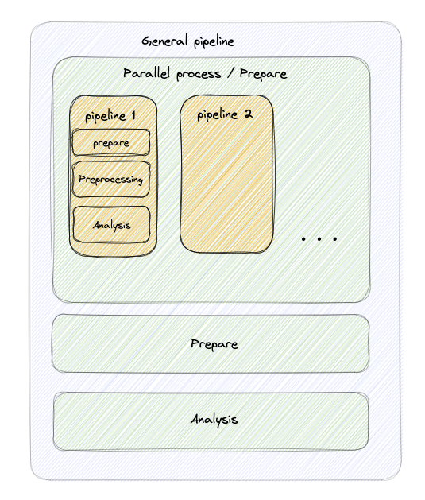

# geodata-analysis
Geodata Analysis is a powerful data processing project focused on analyzing and manipulating census data from Mexico spanning from 1990 to 2020. The project incorporates a robust geo-statistical framework and supports the use of SUN and global raster data. The system utilizes independent pipelines for efficient data analysis and transformation, allowing for easy ingestion, cleaning, filtering, and transformation of large volumes of census data from diverse sources.

Geodata Analysis incorporates advanced statistical techniques, such as geostatistical modeling and spatial interpolation, to provide accurate and actionable insights into Mexican census data. The project is designed for data scientists, social scientists, demographers, and other researchers who want to explore and analyze census data to inform policy decisions.

With its independent pipeline architecture, the system enables efficient data processing and analysis, allowing researchers to focus on generating insights rather than the technical details of data manipulation. Whether you're working on a research project or informing policy decisions, Geodata Analysis provides a powerful set of tools to explore, analyze, and visualize Mexican census data with ease.



## installing dependencies
You have to install the dependencies using conda with the channel Forge. You can do this by running the following command:
```bash
conda install -r requirements.txt
```
## running the code
You can run the code by running the following command:
```bash
python3 main.py
```

## documentation
The documentation about the data can be found in the folder docs.
- [ ] [censos](www.abc.com/abc)

change
**Data collected from:**
- [ ] [abc](www.abc.com/abc)
